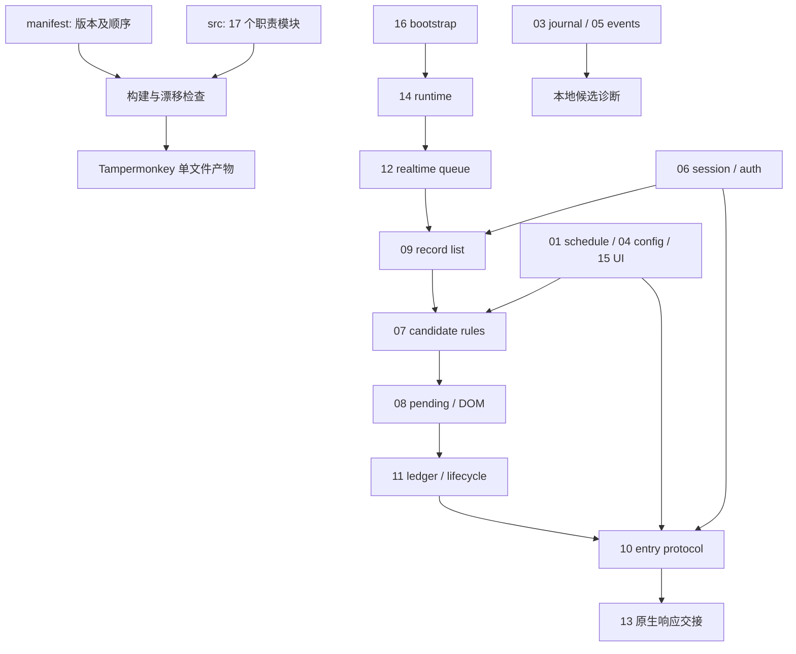

# 源码与维护架构

## 原来为什么慢

- 4186 行、187 个顶层函数集中在一个文件，业务进入、会话、实时队列、日志和 UI 混在一起，定位需要反复扫描。
- 各测试自行按下一个函数名截取源码，重命名或移位容易损坏测试夹具，故障看起来像业务失败。
- 两个 PowerShell 入口和 CI 各复制一份测试名单；新增测试要同步多处，漏测和重复验证风险高。
- 源码、安装内容、页面运行态和历史状态没有统一输出，经常重复 CDP 探测和保存。
- 接管文档累计历史结论，最新事实和过期 404、路径、版本并列；每次接管重新判断。
- 之前维护流程没有充分利用已有本地工具，遇到 CDP 状态变化又重复跨服务调用，这也是维护慢的原因。

## 当前源码组织

`src/manifest.json` 保存唯一版本号、模块顺序和职责，构建替换两个版本占位符，生成根目录单一 `.user.js` 安装产物。模块拼接不插入代码，保持原 IIFE 及初始化顺序。本次迁移按 LF 逐字等价。

| 文件 | 职责 | 行数（迁移基线） |
|---|---|---|
| `src/00-header.js` | 用户脚本元数据和外层IIFE开头 | 25 |
| `src/01-schedule-defaults.js` | 自动进入时段与默认配置 | 183 |
| `src/02-shared-state.js` | 运行/协议/日志的共享状态声明；调整需全量验证 | 74 |
| `src/03-debug-journal.js` | 持久化日志、滚动保留与多文档同步 | 214 |
| `src/04-configuration.js` | 配置迁移、规范化与保存 | 153 |
| `src/05-debug-events.js` | 日志事件结构与候选上下文 | 107 |
| `src/06-session-auth.js` | 会话请求头、协议登录、验证码与账号门禁 | 458 |
| `src/07-candidate-rules.js` | 协议记录规范化、年龄/时间/检查/机构规则 | 277 |
| `src/08-entry-pending-dom.js` | 页面操作解析、进入pending与诊断互斥 | 290 |
| `src/09-record-list.js` | 稳定报告识别、列表请求及窄查询 | 218 |
| `src/10-entry-protocol.js` | 严格进入校验、最终协议取得和导航 | 351 |
| `src/11-entry-ledger-lifecycle.js` | 每报告持久防重与候选生命周期 | 297 |
| `src/12-realtime-queue.js` | 列表处理、轻量探测、实时队列调度 | 293 |
| `src/13-protocol-bridges.js` | 最终响应交接、原生旁听与WebSocket桥 | 604 |
| `src/14-runtime.js` | 扫描、定时、自检、选项更新与启动 | 207 |
| `src/15-settings-ui.js` | 配置面板、方案和主题交互 | 345 |
| `src/16-bootstrap.js` | SPA路由、生命周期启动与收尾 | 89 |

这是处理流程图，并非 ES 模块 import 图。模块仍共享同一闭包、共同函数和可变状态；02 是共享声明。不能把拆文件等同于完全解耦。当前收益是定位、变更归属、构建契约和维护入口清晰，同时避免大规模改变临床运行初始化。

## 症状到模块和测试

| 症状/改动 | 先看 | 专项测试 |
|---|---|---|
| 没及时发现申请、后台阻塞 | 12 → 09 → 06 | realtime-queue / request-preparation |
| 有候选却过滤掉、检查排除 | 07 → 04/15 | locked-entry / exam-exclusions / configuration |
| 校验允许但没载入 | 10 → 13 → 08 | protocol-final / protocol-handoff / report-observer / final-pending |
| 被其它医生锁定 | 07 → 10 → 11 | locked-entry / protocol-final / automatic-once |
| 退出后再次自动进入 | 11 → 08/09 | automatic-once / record-resolution |
| 配置、时段或日志重载丢失 | 04/01/03/15 | configuration / schedule / retention |
| 登录/验证码 | 06 和 tools/captcha_ocr_server.py | direct-login / request-preparation / captcha-ocr |
| 安装或运行版本不同 | 构建 → 更新器 → 核验器 | build-userscript / maintenance-runner / runtime-verifier |

`rg -n "function 函数名|事件文字" src` 可以直接定位；测试代码优先通过 `tests/helpers/source-harness.mjs` 读取模块中的稳定顶层函数名，避免靠相邻函数边界提取。新测试登记 `tools/test-suites.json`；登记表是本地/CI/发布的唯一套件来源。

## 维护链路

1. `status` 一次读取源码、Git、CDP 和实际执行上下文；不可用即明确报告，不反复授权或启动浏览器。
2. `diagnose --name` 一次读取本地日志，后台 worker 睡眠时使用既有同源镜像；历史配置与当前配置分开，缺证据输出不足。
3. 修改源模块，`build --write` 生成；`test --changed` 选择 core + 对应模块套件 + 依赖闭包。
4. build、语法、工作区/暂存区空白检查始终运行。已通过测试只有在全项目内容 hash 不变时缓存；未知/共享路径退回全量。
5. `deploy` 复用原生隐藏保存，分别核实安装 SHA、本次列表重载、当前运行版本。报告页只保存、不刷新。
6. 发布用 `test --all` 强制全量，不使用缓存；GitHub/Raw/CI 单独核实。

## 后续改动的接缝

新业务功能优先保持函数有明确入参/结果，在负责模块补测试。共享状态、初始化顺序或原生桥改动全量验证；需要隔离时先抽纯规则函数，再逐步通过明确上下文传入配置、时间、存储和请求。不要为追求 ES import 重写整个协议/原生桥链。

事件关联仍可增强：为每次进入统一 attemptId/eventCode、为候选决策保存配置 revision/failedRules，才能跨异步阶段可靠算耗时。本次未改业务字节，诊断工具遇到无法唯一关联的历史尝试保持耗时 null/证据不足，不能猜测。

实测与交付边界见 `MAINTENANCE_UPGRADE_20261007.md`。
